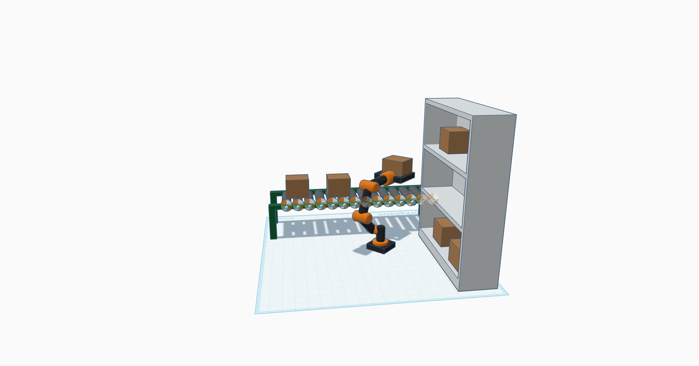

# 🤖 Automated Warehouse Sorting Robot

An intelligent 3D-modeled robotic system built for warehouse automation. This robotic arm is designed to **detect**, **pick**, and **place** boxes from shelving units onto a conveyor belt — simulating a real-world automated logistics process.

  

---

## 🔁 How It Works

The robot operates through a continuous loop:

1. **Start-Up**: All components (robot + conveyor) are powered on.
2. **Box Detection**: Available boxes are located on the shelves.
3. **3D Positioning**: Arm calculates box coordinates for accurate movement.
4. **Pick-Up**: Gripper secures the box from its place.
5. **Transfer Motion**: Arm rotates and extends toward the conveyor.
6. **Box Placement**: Gripper releases box onto the conveyor belt.
7. **Conveyor Movement**: Belt transports the box to the destination.
8. **Repeat Loop**: Cycle repeats for remaining boxes.
9. **Idle/Stop**: System halts or waits for next command.

---

## ⚙️ Core Features

- 🔹 **X-Axis Reach** – Horizontal movement to cover shelf width  
- 🔹 **Y-Axis Control** – Forward/backward reach for shelf depth  
- 🔹 **Z-Axis Lift** – Vertical motion to handle multiple shelf levels  
- 🔹 **Gripper** – Suction or mechanical end-effector for box handling  
- 🔹 **Payload Limit** – Designed for medium-sized cardboard boxes  
- 🔹 **Conveyor Sync** – Smooth coordination with belt system  
- 🔹 **Rotational Axis** – Limited range for target alignment

---

## 📐 Working Envelope

- **X-axis (Width):** ~188 cm  
- **Y-axis (Depth):** ~173.8 cm  
- **Z-axis (Height):** ~142.9 cm  

> 💡 These measurements reflect the maximum physical dimensions of the robot and its operational space.

